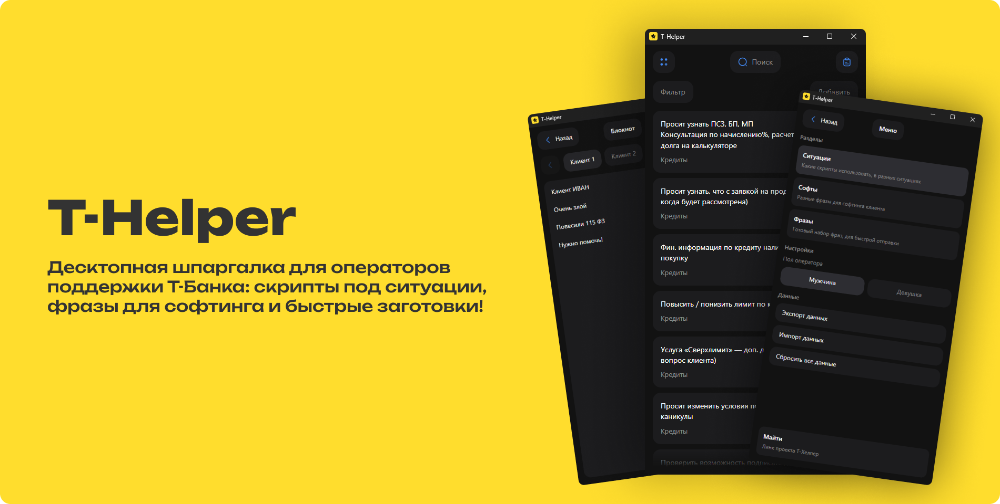

# T-Helper


Windows и macOS (Apple Silicon, M1 и новее).

## Установка на Windows

Скачай **T-Helper_*_x64-setup.exe** из [релизов](https://github.com/whxtelxs/T-Helper/releases/latest) и запусти.

Внутри T-Helper при новой версии будет кнопка **Обновить** - пакет скачается с GitHub и приложение перезапустится. Само ничего не ставится, пока не нажмёшь кнопку.

Проверка и скачивание работают в фоне. Уведомление не блокирует интерфейс; после установки приложение перезапустится. Если скачивание не удалось, кнопка **Открыть релиз** позволит перейти к ручной установке.

Кнопка **Напомнить завтра** откладывает уведомление на сутки. Перед перезапуском приложение дожидается сохранения заметок и остальных изменений.

## Установка на macOS

Видеоинструкция: https://www.youtube.com/watch?v=nXnbfWUh4RU

Нужен Mac на чипе M1 / M2 / M3 / M4 и macOS 11 или новее.

1. Скачай `.dmg` из релизов и открой его.
2. Перетащи **T-Helper** в папку **Программы**.
3. Закрой окно диска. В Finder диск можно извлечь.

**Как открыть:**

1. Открой **Программы**, найди T-Helper.
2. Открой **Терминал**, введи команду:

```bash
xattr -cr 
```
и перетащи иконку T-Helper из приложений в **Терминал**.

Должно получиться:

```bash
xattr -cr /Applications/T-Helper.app
```
3. Нажми **Enter**.

После этого приложение запускается обычным двойным кликом. Новую версию ставят тем же способом, поверх старой, и снова снимают карантин через `xattr`.

В приложении на Mac будет кнопка **Открыть релиз** - она открывает страницу релиза для ручной установки.

## Обмен данными

Экспорт и импорт идут только через файл **`.thelp`**.

Файл можно пересылать между коллегами и между любой версией T-Helper:

- старое приложение читает новый `.thelp` и берёт знакомые разделы (ситуации, софты, фразы);
- разделы, которых в этой версии ещё нет, просто пропускаются;
- новое приложение открывает старые файлы без пересохранения.

Двойной клик по `.thelp` открывает T-Helper и сразу предлагает импорт.

Максимальный размер файла - 8 МБ. Чтение и разбор пакета выполняются в фоне.

Каталоги и заметки хранятся локально в IndexedDB. Данные предыдущих версий переносятся автоматически при первом запуске. Тема и пол оператора остаются в небольшом хранилище настроек. При ошибке сохранения приложение сообщает об этом и не закрывает нативное окно, пока изменения не удастся записать.

## Разработка

```bash
pnpm install
pnpm tauri dev
```

Только фронтенд: `pnpm dev`.

| Команда          | Что делает                              |
| ---------------- | --------------------------------------- |
| `pnpm typecheck` | Проверка типов                          |
| `pnpm lint`      | ESLint                                  |
| `pnpm format`    | Prettier                                |
| `pnpm build`     | Сборка фронтенда                        |
| `pnpm test`      | Регрессионные тесты |

Сборка на своей машине: `pnpm tauri build`. На Mac DMG окажется в
`src-tauri/target/release/bundle`.

## Формат `.thelp`

Бинарный контейнер: магия `THELP`, заголовок, AES-GCM. Ключ в коде - это не шифрование
от чужих глаз, а защита от случайной порчи и чужих файлов.

Внутри - конверт с известными разделами. Новые поля и разделы в будущих версиях
можно добавлять: старый клиент их игнорирует, свои читает как раньше. Номер версии
в файле информативный, импорт от него не отказывается.

## Лицензия

MIT
